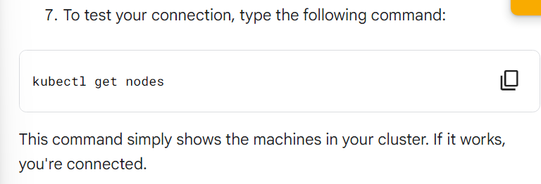
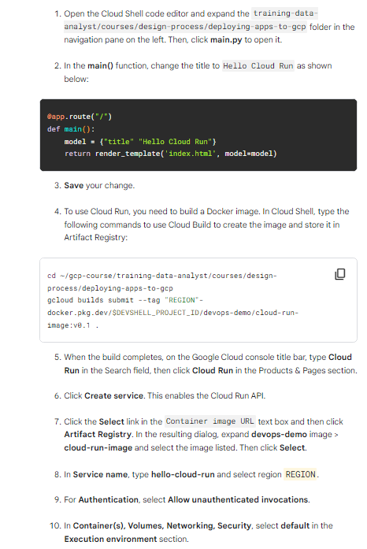

# Deploying Apps TO GOOGLE Cloud

if you have little bit understanding of code in Command Line Shell then this page is for you

here we see the  meanning of each  command , and what to put command for specific task , and the difference between a specific command that we written in Command Shell and the manually doing this work in Google Cloud GUI
#
### 1.--The first task ---
## Download a sample App from Github


```shell

```
- In Line 1 of quickLabGCP.sh file we confirm gcloud authorize List that confirm that user ID is Current 

```shell
gcloud auth list
```

- In Line 2 of quickLabGCP.sh file we need to make a new folder 

```shell
mkdir gcp-course
```

- In Line 3 of quickLabGCP.sh file we change  the folder directory to the new folder dir (in general CLI Shell after openning the terminal it shows USERID )

```shell
cd gcp-course
```

- In Line 4 of quickLabGCP.sh file we Clone a simple Python Flask app from GitHub we clone the Git Reporsitory (training-data-analyst.git)

```shell
git clone https://GitHub.com/GoogleCloudPlatform/training-data-analyst.git
```

- In Line 5 of quickLabGCP.sh file after clone the git we change the directory and move inside the git repository folder where 

```shell
cd training-data-analyst/courses/design-process/deploying-apps-to-gcp
```

- In Line 6 of quickLabGCP.sh file is To test the program, type the following command to build a Docker container of the image:

```shell
docker build -t test-python .
```

- In Line 7 of quickLabGCP.sh file is To run the Docker image, type the following command:
```
docker build -t test-python
```
OR
```shell
docker run --rm -p 8080:8080 test-python
```

# 
Task 2. Deploy to App Engine
-

App Engine is a completely automated deployment platform. It supports many languages, including Python, Java, JavaScript, and Go. To use it, you create a configuration file and deploy your applications with a couple of simple commands. In this task, you create a file named app.yaml and deploy it to App Engine.

```shell

```

in this below image this is manual process

of

adding (app.yaml) file in the folder where git repository is clone ->gcp-course  ->   training-data-analyst  -> courses  -> design-process   -> deploying-apps-to-gcp


- In Line 8 & 9 , 10  of quickLabGCP.sh file In the terminal because we are already on that folder where  Python Flask App is cloned 

   then

   we just need to create app.yml  file and this command also save the changes automatically that we created a file  and save the command 
   
    runtime: python39

    ```
    cat > app.yaml <<EOF_END
    runtime: python39
    EOF_END
    ``` 

- In Line 11 of qwicklabGCP. sh we create the App Engine Application 

  once using the " gcloud app create " command and specifying the region where you want the app to be created.
  ```
   gcloud app create --region=$REGION

  ```

- In Line 12 of qwicklabGCP. sh deploy your app with the following command:

   ```
    gcloud app deploy --version=one --quiet
   ```

    -- Manually process to test the Link on App Engine Dashboard 
     

- Now we make 2nd Version by going main.py file
and change the line title "Hello GCP" from 1st version to "Hello App Engine" to 2nd version

  this image show manually process 
   


  other way

  In Line 13  of quicklabGCP.sh  we make changes in title "Hello App Engine" in the main.py file through terminal 
     ```
    sed -i '8c\    model = {"title": "Hello App Engine"}' main.py
     ```

- In Line 14  of quicklabGCP.sh we deploy our second version  Pyhton Flask App Engine 
   ```
   gcloud app deploy --version=two --no-promote --quiet
   ```

- In Line 15 of quicklabGCP.sh we migrate production traffic to version two by using Split Traffic service in Version Tab of App Engine  
and the reason we do when check link of App Engine Dashboard we will found it is running Version 1 it is because of the --no-promote parameter in the previous command.

   ```
    gcloud app services set-traffic default --splits=two=1 --quiet

   ```
  if we do manually here what it is:- 
  
#
Task 3. Deploy to Kubernetes Engine with Cloud Build and Artifact Registry
-

Kubernetes Engine allows you to create a cluster of machines and deploy any number of applications to it. Kubernetes abstracts the details of managing machines and allows you to automate the deployment of your applications with simple CLI commands.

To deploy an application to Kubernetes, you first need to create the cluster. Then you need to add a configuration file for each application you will deploy to the cluster.

 here below is through terminal you can create 
 ```
 gcloud beta container --project "$DEVSHELL_PROJECT_ID" clusters create-auto "autopilot-cluster-1" --region $REGION --release-channel "regular" --network "projects/$DEVSHELL_PROJECT_ID/global/networks/default" --subnetwork "projects/$DEVSHELL_PROJECT_ID/regions/$REGION/subnetworks/default" --cluster-ipv4-cidr "/17" --binauthz-evaluation-mode=DISABLED

gcloud container clusters get-credentials autopilot-cluster-1 --region $REGION --project $DEVSHELL_PROJECT_ID

kubectl get nodes

sed -i '8c\    model = {"title": "Hello Kubernetes Engine"}' main.py


cat > kubernetes-config.yaml <<EOF_END
---
apiVersion: apps/v1
kind: Deployment
metadata:
  name: devops-deployment
  labels:
    app: devops
    tier: frontend
spec:
  replicas: 3
  selector:
    matchLabels:
      app: devops
      tier: frontend
  template:
    metadata:
      labels:
        app: devops
        tier: frontend
    spec:
      containers:
      - name: devops-demo
        image: <YOUR IMAGE PATH HERE>
        ports:
        - containerPort: 8080

---
apiVersion: v1
kind: Service
metadata:
  name: devops-deployment-lb
  labels:
    app: devops
    tier: frontend-lb
spec:
  type: LoadBalancer
  ports:
  - port: 80
    targetPort: 8080
  selector:
    app: devops
    tier: frontend
EOF_END


gcloud artifacts repositories create devops-demo \
    --repository-format=docker \
    --location=$REGION

gcloud auth configure-docker $REGION-docker.pkg.dev

cd ~/gcp-course/training-data-analyst/courses/design-process/deploying-apps-to-gcp
gcloud builds submit --tag $REGION-docker.pkg.dev/$DEVSHELL_PROJECT_ID/devops-demo/devops-image:v0.2 .


sed -i "23c\        image: $REGION-docker.pkg.dev/$DEVSHELL_PROJECT_ID/devops-demo/devops-image:v0.2" kubernetes-config.yaml


kubectl apply -f kubernetes-config.yaml

kubectl get pods

kubectl get services


sed -i '8c\    model = {"title": "Hello Cloud Run"}' main.py


cd ~/gcp-course/training-data-analyst/courses/design-process/deploying-apps-to-gcp
gcloud builds submit --tag $REGION-docker.pkg.dev/$DEVSHELL_PROJECT_ID/devops-demo/cloud-run-image:v0.1 .


sleep 30
 ```   

if we do manually then
    

#
Task 4. Deploy to Cloud Run
-
Cloud Run simplifies and automates deployments to Kubernetes. When you use Cloud Run, you don't need a configuration file. You simply choose a cluster for your application. With Cloud Run, you can use a cluster managed by Google, or you can use your own Kubernetes cluster.

To use Cloud Run, your application needs to be deployed using a Docker image and it must be stateless.

if you run in the terminal:-
```
# Store the output of the command in a variable
image_digest=$(gcloud container images list-tags $REGION-docker.pkg.dev/$DEVSHELL_PROJECT_ID/devops-demo/cloud-run-image --format='get(digest)' --limit=10)


echo "y" | gcloud run deploy hello-cloud-run \
--image=$REGION-docker.pkg.dev/$DEVSHELL_PROJECT_ID/devops-demo/cloud-run-image@$image_digest \
--allow-unauthenticated \
--port=8080 \
--max-instances=6 \
--cpu-boost \
--region=$REGION \
--project=$DEVSHELL_PROJECT_ID
```
if you do manually:- 